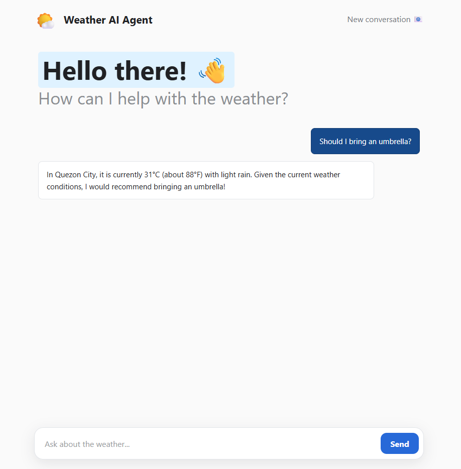
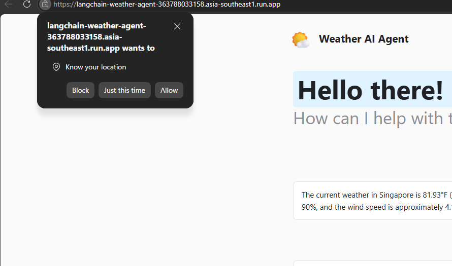

# LangChain Gemini Weather Agent

A conversational weather assistant built with Flask, LangChain, Google Gemini,
and OpenWeather. It answers questions about named cities or uses browser
geolocation to find weather near the user.

## Live Demo

**[Open the Weather AI Agent](https://langchain-weather-agent-363788033158.asia-southeast1.run.app/)**



## Features

- Natural-language weather questions and follow-up messages
- Browser-based location detection with user permission
- Live weather conditions from OpenWeather
- Gemini tool calling through LangChain
- Conversation memory powered by LangGraph and SQLite checkpoints
- Suggested prompts, typing indicators, and responsive chat UI
- Docker and Google Cloud Run deployment support
- Friendly in-chat error handling with detailed server logs

## How It Works

1. The user submits a weather question in the Flask chat interface.
2. If the question names a city, the agent calls `get_weather()` directly.
3. If no city is provided, the browser sends coordinates after permission is granted.
4. `get_location()` reverse-geocodes the coordinates with OpenStreetMap Nominatim.
5. LangGraph loads and saves conversation state using a per-session thread ID.
6. The agent retrieves conditions from OpenWeather and Gemini writes the answer.



Location permission is optional. Users can deny it and enter a city manually.

## Tech Stack

- Python 3.13
- Flask and Gunicorn
- LangChain and LangGraph
- Gemini 3.1 Flash-Lite
- OpenWeather API
- OpenStreetMap Nominatim
- LangGraph `SqliteSaver` for conversation memory
- SQLite
- Docker and Google Cloud Run

## Conversation Memory

The assistant uses LangGraph's `SqliteSaver` checkpointer to retain conversation
state. Each browser session receives a unique `thread_id`, allowing the agent to
understand follow-up questions such as "Should I bring an umbrella?" without the
user repeating the location or previous weather context.

For local development and a single Cloud Run instance, checkpoints are stored in
`checkpoints.db`. Cloud Run's filesystem is ephemeral, so this memory can be
reset when the instance restarts. A managed database should be used when durable
memory across deployments or multiple instances is required.
## Local Setup

### 1. Clone the repository

```bash
git clone https://github.com/grayhams74s/langchain-gemini-weather-agent.git
cd langchain-gemini-weather-agent
```

### 2. Create a virtual environment

Windows PowerShell:

```powershell
python -m venv .venv
.\.venv\Scripts\Activate.ps1
```

macOS or Linux:

```bash
python3 -m venv .venv
source .venv/bin/activate
```

### 3. Install dependencies

```bash
python -m pip install -r requirements.txt
```

### 4. Configure environment variables

Create a `.env` file in the project root:

```env
GOOGLE_API_KEY=your_google_gemini_api_key
OPENWEATHER_API_KEY=your_openweather_api_key
FLASK_SECRET_KEY=your_random_flask_secret
```

Generate a Flask secret with:

```bash
python -c "import secrets; print(secrets.token_urlsafe(64))"
```

Do not commit `.env`. It is excluded by `.gitignore` and `.dockerignore`.

### 5. Run the application

```bash
python app.py
```

Open `http://127.0.0.1:5000` and allow location access when prompted, or ask
about a specific city.

## Docker

```bash
docker build -t weather-ai-agent .
docker run --rm -p 8080:8080 \
  -e GOOGLE_API_KEY=your_key \
  -e OPENWEATHER_API_KEY=your_key \
  -e FLASK_SECRET_KEY=your_secret \
  weather-ai-agent
```

Then open `http://localhost:8080`.

## Google Cloud Run

The included `Dockerfile` supports source-based Cloud Run deployments. Connect
the repository, select the `master` branch, and configure:

- Region: `asia-southeast1` (Singapore)
- Container port: `8080`
- Authentication: allow public access
- Maximum instances: `1` while using local SQLite

Add `GOOGLE_API_KEY`, `OPENWEATHER_API_KEY`, and `FLASK_SECRET_KEY` through Cloud
Run environment variables or Secret Manager.

Cloud Run's local filesystem is ephemeral. SQLite checkpoints may be reset when
an instance restarts and are not shared across instances. Use a managed database
when durable, multi-instance conversation memory is required.

## Project Structure

```text
.
|-- app.py
|-- agent.py
|-- Dockerfile
|-- requirements.txt
|-- templates/
|   `-- chat.html
|-- static/
|   `-- favicon.ico
|-- images/
|   |-- ai agent.png
|   |-- permission.png
|   `-- snapshot.png
|-- README.md
`-- .gitignore
```

## Earlier Prototype

The project began as a command-line LangChain weather agent before gaining the
Flask chat interface and Cloud Run deployment.


## Privacy

Precise browser coordinates are requested only after the user grants location
permission. The coordinates are submitted to this application and sent to
OpenStreetMap Nominatim for reverse geocoding. Users can avoid location access
by entering a city manually.
